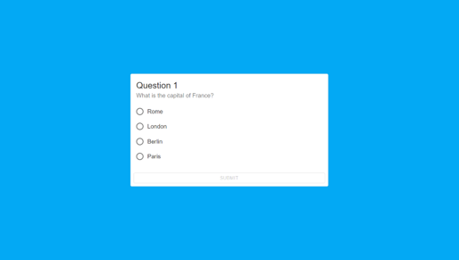
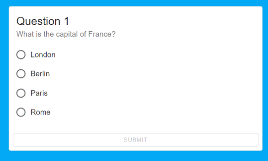
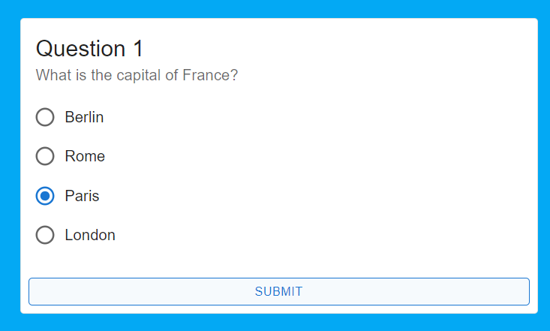
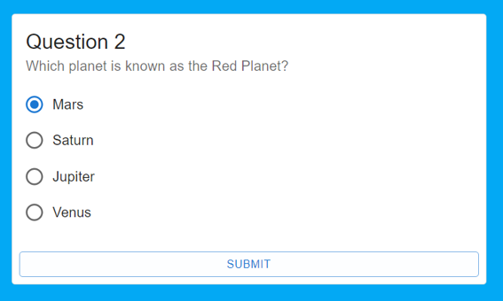
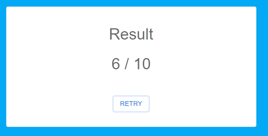

# React + Vite project sample

## Quiz - OOP, MUI

A alábbi linken találhatóak egy quiz létrehozásához szükséges adatok az alábbi JSON fájlban:
[Adatok- json fájl](https://raw.githubusercontent.com/mkatay/json_quiz/main/questions)

Adva van a projekt forrás strukturája, az alábbi linken:
[Forrás- React-Vite project](https://github.com/mkatay/quiz_forras)

A forrásmappában egy **Quiz.class.js** fájl van. A fájlban található osztályban minden szükséges attribútum, metódus, függvény megtalálható a  quiz logikájának a megvalósításáshoz! 
- Az App.jsx komponensben létrehozott **quiz** state a komponens betöltődésekor kapja meg az adatokat tartalmazó tömböt használva az **axios** vagy a **fetch** apit.
- Az App.jsx-ben létrehozott **gameState** state az aktuális állapotot kell tükrözze. A komponens betöltődésekor inicializáld példányosítással a megadott **Quiz** osztályból.

Ezt használva valósítsd meg a minta szerinti quiz alkalmazást!

Publikálás a Netlify-on:
[Quiz game](https://659295f35e2c05aceafdfcd9--admirable-heliotrope-980a5a.netlify.app/)